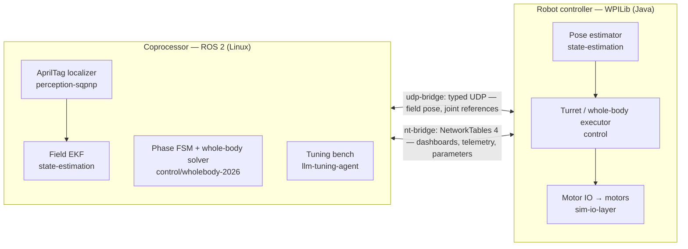
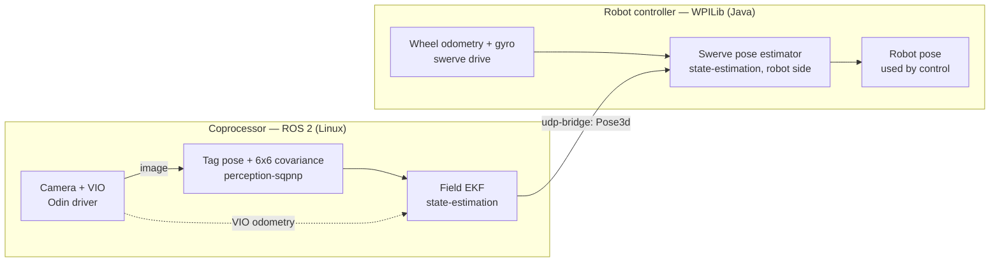
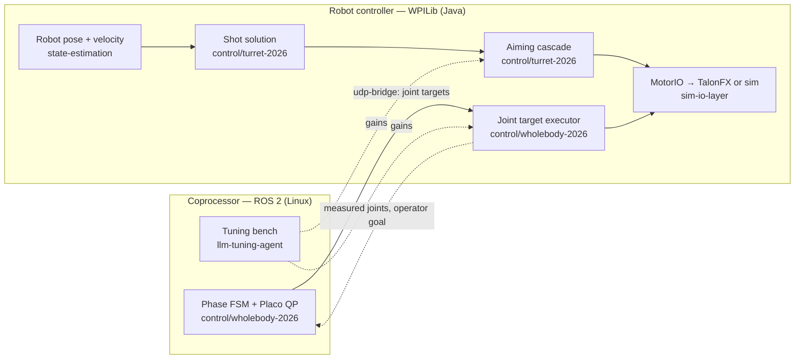

# Robotics showcase — Mai


Zile Liao — robotics software, Freiburg.

Clone is ~16 MB (a fresh single-commit history; the replay clips are most of it).

I build the software that lets a competition robot know where it is and act on it: camera-based
perception, state estimation, the transport between a ROS 2 coprocessor and the robot
controller, motion control, and tooling for tuning controllers. This repository shows what that
system is and what it produced.

The algorithms themselves (solver, filter, control laws) are not published. The recordings below
are the real system's inputs and outputs; the scripts compute the numbers in this README from those
recordings alone. Full code, with the source excerpts and recompute checks, is available upon
request.

## Architecture

The software is two programs. A ROS 2 graph on a Linux coprocessor does the heavy work: vision,
state estimation and whole-body inverse kinematics. The WPILib robot program on the robot
controller owns the motors. The two talk only through the two bridges.

### Overview: what runs where



On the coprocessor, `perception-sqpnp` and `state-estimation` turn camera images into a field
pose, `control/wholebody-2026` runs the phase state machine and the whole-body solver, and
`llm-tuning-agent` runs gain experiments on a bench. `udp-bridge` carries what the robot acts on.
`nt-bridge` mirrors state into NetworkTables for dashboards and logging, and carries parameter
edits. On the robot, the pose estimator keeps the pose, `control/turret-2026` aims,
`control/wholebody-2026` applies the joint targets, and `sim-io-layer` drives the motors, or a
simulation of them.

### Vision: from pixels to a field pose



A camera frame becomes a tag fix with its own covariance. The EKF fuses the fixes with the camera's
visual-inertial odometry, the result crosses `udp-bridge` as a 56-byte `Pose3d` datagram, and the
robot's estimator fuses it with wheel odometry. [docs/architecture.md](docs/architecture.md) goes one
level deeper into the two layers of pose estimation: frames, timestamps, and where the covariance
goes.

### Control: from a target to motor commands



The turret's shot solution turns the robot's pose and velocity into an aim, and the aiming cascade
turns that aim into a velocity command and a feedforward for the motor controller's own loop. The
whole-body node streams joint targets over `udp-bridge`; the robot hands them to the motor
controllers' position loops and sends the measured joints and the operator's goal back. The robot
never sees the phase. The tuning bench ran gain sweeps for the arm joints, and a fork of it retuned
the turret's loops; gains reach the robot side through `nt-bridge`.

## Modules

| Module | What it shows | Status | Open in viewer |
|---|---|---|---|
| [perception-sqpnp](perception-sqpnp/) | AprilTag localizer: all visible tags solved as one target, with a covariance computed from the fit | recording + viewer + measured numbers | **[▶ Open in viewer](https://replay-viewer-e62.pages.dev/?ds=remote-file&ds.url=https%3A%2F%2Fpub-0f92a4b175d3420290d73d6c2242fb57.r2.dev%2Fmatch%2Fmatch-20s.mcap&layoutUrl=https%3A%2F%2Fpub-0f92a4b175d3420290d73d6c2242fb57.r2.dev%2Fmatch%2Ffoxglove-layout.json)** |
| [state-estimation](state-estimation/) | EKF over the robot's field pose (VIO predict, tag update); robot-side fusion with wheel odometry | recording + viewer + measured numbers | **[▶ Open in viewer](https://replay-viewer-e62.pages.dev/?ds=remote-file&ds.url=https%3A%2F%2Fpub-0f92a4b175d3420290d73d6c2242fb57.r2.dev%2Fmatch%2Fmatch-20s.mcap&layoutUrl=https%3A%2F%2Fpub-0f92a4b175d3420290d73d6c2242fb57.r2.dev%2Fmatch%2Ffoxglove-layout.json)** |
| [udp-bridge](udp-bridge/) | Typed UDP publish/subscribe between the Java robot program (via JNI) and ROS 2, with clock sync | recording + viewer + measured numbers | **[▶ Open in viewer](https://replay-viewer-e62.pages.dev/?ds=remote-file&ds.url=https%3A%2F%2Fpub-0f92a4b175d3420290d73d6c2242fb57.r2.dev%2Fudp-bridge%2Fclock-sync-154s.mcap&layoutUrl=https%3A%2F%2Fpub-0f92a4b175d3420290d73d6c2242fb57.r2.dev%2Fudp-bridge%2Ffoxglove-layout.json)** |
| [nt-bridge](nt-bridge/) | NetworkTables 4 ↔ ROS 2 mirror for dashboards and tools (by Zimeng Chai) | infrastructure excerpt | — |
| [sim-io-layer](sim-io-layer/) | One motor interface with a real (TalonFX) and a simulated implementation | infrastructure excerpt | — |
| [control/turret-2026](control/turret-2026/) | Turret aiming cascade and shoot-on-the-move compensation | recording + measured numbers | — (CSV) |
| [control/wholebody-2026](control/wholebody-2026/) | Whole-body control: phase state machine and Placo QP on the coprocessor, joint targets executed by the robot | recording + viewer | **[▶ Open in viewer](https://replay-viewer-e62.pages.dev/?ds=remote-file&ds.url=https%3A%2F%2Fpub-0f92a4b175d3420290d73d6c2242fb57.r2.dev%2Fwholebody-shop%2Fwholebody-cycle-shop.mcap&layoutUrl=https%3A%2F%2Fpub-0f92a4b175d3420290d73d6c2242fb57.r2.dev%2Fwholebody-shop%2Ffoxglove-layout.json)** |
| [llm-tuning-agent](llm-tuning-agent/) | PID tuning bench steered by a coding agent, inside hard limits | clip only (website) | — |

Clips of each project running: https://mai961.github.io/

## Recordings

Five modules come with a short recording of the real system. `state-estimation`,
`control/wholebody-2026` and `udp-bridge` each have a `replay/` folder holding an MCAP file and its
`metadata.yaml`, which `ros2 bag play` and Foxglove Studio open. `perception-sqpnp` shares the one
match recording, `state-estimation/replay/match-20s.mcap`, which carries the localizer's outputs as
well as the EKF's, so both modules open in the same viewer. `control/turret-2026` has a CSV
converted from the robot program's log. Each file was cut from a
recorded bag or log to one window of 6 to 30 s (the whole 154 s for the clock topic), keeping only
the topics that module reads or produces, and renamed; no full bag is included. Camera images are
blurred except for the AprilTags and the localizer's overlay. Each module's README names the source
recording and window, lists the topics, and shows how to open the file, including a few lines of
Python that need no ROS install. Each MCAP recording also opens in the browser, with its layout, in
a hosted viewer at https://replay-viewer-e62.pages.dev/ (Lichtblick, an open-source build of
Foxglove Studio; no sign-in); the table above links each one. `nt-bridge`, `sim-io-layer` and
`llm-tuning-agent` have no recording.

Recordings © Zile Liao: they may be viewed and analysed, not redistributed. The scripts, layouts
and documentation are MIT-licensed (see License below).

## Run the analyses

Four modules have a script in `replay/` that reads the module's recording and reports what can be
read off it. The scripts only read what the system logged: no solver, no filter, no control law.
They need Python 3 with the three packages in `requirements.txt` (the turret's needs only numpy and
matplotlib); no ROS install. From the repository root:

```sh
pip install -r requirements.txt
python perception-sqpnp/replay/analyze_localizer.py      # 0.8 s
python state-estimation/replay/analyze_field_ekf.py      # 2.0 s
python control/turret-2026/replay/analyze_turret.py      # 0.5 s
python udp-bridge/replay/analyze_clock.py                # 0.6 s
```

Each prints its summary, the output its module's README quotes and explains, and writes its figures
to `<module>/replay/replay_out/`, next to the script (`--out <dir>` picks another, `--help` lists
the options). [`.github/workflows/analyze.yml`](.github/workflows/analyze.yml) runs all four on
every push and pull request; the badge at the top shows its latest result.

| Module | What the analysis reads | Number |
|---|---|---|
| [perception-sqpnp](perception-sqpnp/#analysis) | `~/detections` records, `~/pose` with its covariance, the logged reprojection error | 110 of 183 frames solved as one pooled target; chosen-tag reprojection error median 0.035 px, as logged |
| [state-estimation](state-estimation/#analysis) | The EKF's pose, the tag fixes and their covariance, the node's logged per-fix values | 130 updates in 20 s on 400 Hz VIO; logged innovation median 1.0 cm |
| [control/turret-2026](control/turret-2026/#analysis) | The CSV's logged target and measured turret angle | tracking RMS 0.90° in TRACK |
| [udp-bridge](udp-bridge/#analysis) | The logged clock-sync estimate | offset 2.845 s → 2.827 s over 154 s, round trip median 0.34 ms |

## How to read this repo

Every module has a README with the same sections: What it does, Why it exists, How it works,
Interfaces, How it was run, Replay, Status, Credits. "How it works" says what the module does and
why the design was chosen, in one paragraph; it is not a recipe. "Replay" describes the recording,
how to open it in the viewer, and the analysis of it. The Status line says what the module holds:
"recording + viewer + measured numbers" for a module with an MCAP recording and an analysis script,
"recording + measured numbers" for the turret's CSV, "recording + viewer" for the whole-body
recording, "infrastructure excerpt" for the simplified source of the bridges and the motor layer,
and "clip only (website)" for the tuning agent. Any number the recordings do not contain is written
as "not measured".

## Credits

Each module's Credits section says who wrote what, based on `git log` of the private source
repositories. Most of the work shown is mine. `sim-io-layer` and `control/turret-2026` were written
with contributions from teammates. `perception-sqpnp` grew from a port by Zimeng Chai
(`KeseterG`). `nt-bridge` is his work, included because it is the other half of the transport
story, and the ROS side of `udp-bridge` reuses its topic machinery.

Parts of this code were written with AI coding assistants under the author's direction.

## License

MIT ([LICENSE](LICENSE)) for the scripts, layouts and documentation; the `udp-bridge` and
`nt-bridge` excerpts keep their packages' BSD-3-Clause license. The recordings in `*/replay/`
(`.mcap`, `.csv`) are © Zile Liao: they may be viewed and analysed, not redistributed.

---

This repository shows what the system is and what it produced; the robot code itself is not public.
