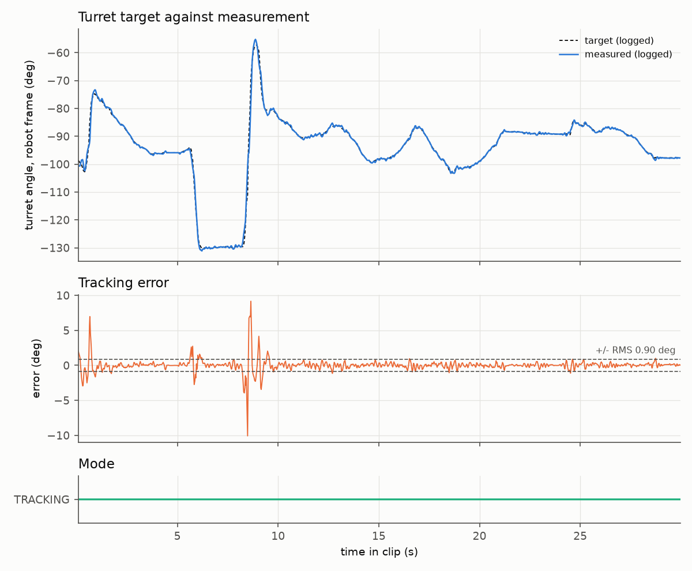

# control/turret-2026: turret aiming cascade and shoot-on-the-move compensation

Shown in motion on my project site: https://mai961.github.io/#shoot-on-the-move

## What it does

It points a shooter turret at a target while the robot drives. A shot solution turns the robot's
position and velocity into where to aim and how hard to shoot, so that a ball fired from a moving
robot still arrives on target. An aiming controller then drives the turret to that angle. It is a
cascade: an outer loop in the robot program turns the angle error into a velocity command every
20 ms, with feedforward, and the motor controller's own velocity loop tracks that command.

## Why it exists

A plain position PID on a turret either lags a moving target or overshoots on large moves. The
source code comments record what the logs showed: the robot loop ran slower than its nominal 20 ms,
the aim target lagged the real heading, and overshoots came from arriving at the target too fast.
The controller's design answers those findings. The shot compensation exists because a ball keeps
the robot's velocity. Driving toward or across the line of sight moves where it lands, so a table
built for a standing robot is not enough.

## How it works

The aiming loop is a cascade with feedforward: the robot program's outer loop turns the angle error
into a velocity command, a large move and fine tracking are handled in separate modes, and the
motor controller's velocity loop closes the inner loop. The feedforward takes out what the outer
loop can predict, such as the chassis turning under the turret and a cable spring that pulls the
turret toward zero. The shot solution compensates for the robot's own velocity at the moment of
release, so the aim and the shot strength account for the motion the ball inherits.

## Interfaces

| In | Out |
|---|---|
| Robot pose and velocity (from the pose estimator, see `state-estimation`) | Turret yaw target |
| Commanded and measured chassis turn rate | Hood angle and ball exit speed (to the shooter) |
| Turret position and velocity from `MotorIO` (see `sim-io-layer`) | Velocity setpoint and feedforward volts to `MotorIO` |

## How it was run

The controller and the shot solution ran every 20 ms in the robot program on the roboRIO. The
turret's velocity loop ran on its TalonFX motor controller. The gains are live-tunable parameters,
and they were tuned on a bench and from logs of recorded driving sessions.

## Replay

The shot compensation was off in this clip: the turret held a fixed field heading, not the shot
solution, so the clip shows the aiming cascade and not the compensation.
`replay/turret-tracking-30s.csv` holds 30 s of the turret tracking that heading while the robot
drives at up to 3 m/s. It was converted from the robot program's recorded log `run_14.wpilog` (an
AdvantageKit log), 11.5 s to 41.5 s after the log's start, and renamed: 1,045 rows, 0.14 MB. There
is one row per robot loop in which the turret logged its loop time. AdvantageKit records a value
only when it changes, so each column holds its latest logged value at that row's time. Values are
rounded to 2 to 5 decimals.

| Columns | Unit | Logged as |
|---|---|---|
| `time_s` | s | Time since the window start |
| `loop_dt_ms` | ms | The turret's measured loop period |
| `turret_mode` | | `SEEKING` or `TRACKING`; TRACKING throughout this window |
| `target_angle_robot_deg`, `measured_angle_robot_deg` | deg | The turret's target and measured angle, robot frame |
| `aim_error_abs_deg` | deg | The absolute aim error |
| `velocity_setpoint_dps`, `measured_velocity_dps` | deg/s | The outer loop's velocity command to the TalonFX, and the measured velocity |
| `spring_comp_volts` | V | The spring feedforward voltage |
| `motor_position_rot`, `motor_velocity_rot_per_s`, `motor_output_volts`, `motor_supply_volts`, `motor_stator_current_a` | rot, rot/s, V, V, A | The turret motor's `MotorInputs` (see `sim-io-layer`): `positionRot`, `velocityRotPerSecond`, `motorVolts`, `appliedVolts` (filled with the supply voltage on the TalonFX) and `currentStatorAmps` |
| `chassis_vx_mps`, `chassis_vy_mps`, `chassis_omega_radps` | m/s, rad/s | Chassis velocity from the swerve modules, robot frame |
| `shot_turret_angle_world_cmd_deg` | deg | The shot solution's turret angle, field frame; computed every loop but not followed in this clip |
| `shot_distance_m` | m | Distance from the shot point to the target |

In this clip the turret's target was its default one, the field heading 0°. In the full log, the
robot-frame target is that heading turned into the robot frame, and the shot compensation stays
switched off until after the clip ends (checked against the full log while preparing this
repository; not reproducible here). The clip shows the cascade holding a fixed field heading while
the chassis drives and turns under it.

Open it in any spreadsheet or plotting tool; plot `target_angle_robot_deg` and
`measured_angle_robot_deg` against `time_s`. It has no hosted viewer link: the viewer opens MCAP
files, and this is a CSV.

What to look for: the robot drives at up to 3.0 m/s and turns at up to 4.4 rad/s, and the target
angle swings by up to 72° within one second. While the robot moves faster than 0.5 m/s (54% of the
rows), the median aim error is 0.26°, and 90% of those rows are under 0.91°. The loop period shows
what the code comments describe: the robot loop ran slower than its nominal 20 ms (median 26 ms
here, up to 109 ms).

Read it with Python's standard library, from the repository root:

```python
import csv, statistics

rows = list(csv.DictReader(open("control/turret-2026/replay/turret-tracking-30s.csv")))
moving = [r for r in rows
          if (float(r["chassis_vx_mps"]) ** 2 + float(r["chassis_vy_mps"]) ** 2) ** 0.5 > 0.5]
err = statistics.median(float(r["aim_error_abs_deg"]) for r in moving)
print(f"{len(rows)} rows, {len(moving)} while moving; median aim error {err:.2f} deg")
```

### Analysis

`replay/analyze_turret.py` reads the CSV's logged columns and nothing else: target and measured
angle, mode, logged aim error, loop period and chassis velocity. It runs no control law. It needs
only numpy and matplotlib. From the repository root:

```sh
pip install -r requirements.txt     # numpy, matplotlib (mcap-ros2-support is not needed here)
python control/turret-2026/replay/analyze_turret.py     # --log <csv>, --out <dir>, --help
```

Output (0.5 s):

```
clip: turret-tracking-30s.csv   1045 rows over 29.9 s (TRACKING 1045)
chassis up to 3.0 m/s and 4.4 rad/s; robot-frame target swings up to 72 deg within 1 s
loop period median 26 ms, max 109 ms
tracking error in TRACK (target - measured, 1045 rows): RMS 0.90 deg, median |e| 0.18 deg, 90 % under 0.78 deg, max 10.08 deg
logged aim error above 0.5 m/s (568 rows, 54 %): median 0.26 deg, 90 % under 0.91 deg
shot compensation: compensation was off in this clip; no logged compensation values, so no compensation plot
wrote control/turret-2026/replay/replay_out/tracking.png
```

The tracking error stays under 0.8° on 90 % of the rows. Every error above 2.5° falls in the first
second or in the fastest swings of the robot-frame target, near 5.8 s and from 8.3 s to 9.2 s, when
the target moves by tens of degrees in under a second; the largest, 10°, is at 8.5 s.



Recordings © Zile Liao: they may be viewed and analysed, not redistributed. The scripts and text
are MIT-licensed with the rest of the repository.

## Status

**Status: recording + measured numbers.** The controller's and the shot solution's source are not
in this repository. The numbers above are read from the recording by `replay/analyze_turret.py`.
Latency, hit rate at the target and aim at the target were not measured: in the clip the turret
held a fixed field heading.

Replay data: `replay/turret-tracking-30s.csv` (converted from a recorded robot log; not the full
log).

## Credits

Written by Zile Liao, with contributions from teammates: 24 of 37 non-merge commits on
`TurretSubsystem.java` and `ShotCalculator.java` are his
(`git log --no-merges --format=%an -- <files>` in the source repository). The shot-compensation
analysis document (kept in the private companion) is his alone (3 of 3 commits).
