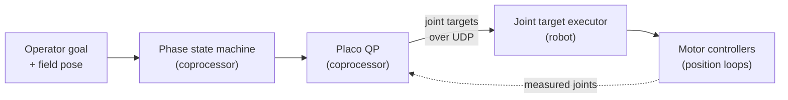

# control/wholebody-2026: whole-body control with a Placo QP on the coprocessor

[](https://replay-viewer-e62.pages.dev/?ds=remote-file&ds.url=https%3A%2F%2Fpub-0f92a4b175d3420290d73d6c2242fb57.r2.dev%2Fwholebody-shop%2Fwholebody-cycle-shop.mcap&layoutUrl=https%3A%2F%2Fpub-0f92a4b175d3420290d73d6c2242fb57.r2.dev%2Fwholebody-shop%2Ffoxglove-layout.json) **[▶ Open in viewer](https://replay-viewer-e62.pages.dev/?ds=remote-file&ds.url=https%3A%2F%2Fpub-0f92a4b175d3420290d73d6c2242fb57.r2.dev%2Fwholebody-shop%2Fwholebody-cycle-shop.mcap&layoutUrl=https%3A%2F%2Fpub-0f92a4b175d3420290d73d6c2242fb57.r2.dev%2Fwholebody-shop%2Ffoxglove-layout.json)**

Shown in motion on my project site: https://mai961.github.io/#whole-body-control

## What it does

It moves a robot's arm, and when needed its chassis, so that the end of the arm (the end
effector) reaches a pose fixed on the field. The robot is a swerve chassis carrying a planar arm
with three joints: a shoulder, a telescope and a wrist. The work is split between two computers:

1. **On the coprocessor**: a Python ROS 2 node holds a kinematic model of the whole robot, arm and
   chassis. A phase state machine decides what the arm should be doing, and every tick a quadratic
   program (QP) built with the Placo library solves for the next joint positions. The node streams
   the arm's joint targets to the robot.
2. **On the robot**: the WPILib robot program writes the newest joint targets to the motor
   controllers as position targets. It reports back the measured joints and the goal the operator
   is holding, and hands the chassis to the coprocessor only behind a deadman button.

The state machine runs on the coprocessor. The robot never sees the phase.

## Why it exists

The robot program's README states the aim: "instead of hand-writing arm setpoints and state
machines, an onboard computer (NUC) runs the Placo QP solver to decide *how* the whole robot
(chassis + arm) should move, and the RIO just closes the control loops." The RIO (roboRIO) is the
robot's main controller.

The source's architecture document calls the resulting motion emergent: "you declare WHAT
(tasks + targets + weights), the QP solves HOW each frame moves, and the EE path falls out of the
solution." No end-effector path is drawn.

## How it works



The phase machine runs DRIVE → APPROACH → TASK → RETRACT → DRIVE. In APPROACH the arm takes its
aim posture while the chassis drives to a staging pose for the goal, and TASK starts only when both
have arrived. In TASK one QP moves the arm and the chassis together toward the goal, which is fixed
in the field, so wherever the chassis parked the end effector still goes to the same field point.
TASK lasts as long as the operator holds the goal; letting go retracts the arm and returns to
DRIVE.

The two streams to the robot fail in opposite ways, on purpose. A lost arm target leaves the arm
holding the last one, while a stale chassis command stops the chassis. The source's architecture
document calls both choices deliberate: a runaway chassis is the hazard to avoid, while "a frozen
arm reference is safe."

## Interfaces

| Direction | UDP topic | Payload | Meaning |
|---|---|---|---|
| coprocessor → robot | `wholebody/references` | `double[3]` | Joint targets for the three joints |
| robot → coprocessor | `wholebody/measured` | `double[3]` | Measured joints |
| robot → coprocessor | `wholebody/goal` | `string` | The goal the operator holds; `""` = none (stow) |
| coprocessor → robot | `wholebody/status` | `double[4]` | The phase (1-4 = DRIVE…RETRACT) and task errors; logged only |
| coprocessor → robot | chassis command | | Used by the robot only while the operator holds the deadman button |

On the coprocessor the joint streams are ROS 2 `sensor_msgs/JointState` messages, carried over the
UDP bridge (see `udp-bridge`). The coprocessor also reads the robot's field pose
(`/odin_tree/field_base`, from `state-estimation`) directly over ROS 2.

## How it was run

The coprocessor node ran on a ROS 2 timer on the robot's coprocessor, next to the UDP bridge.
The robot side ran in the WPILib robot program on the roboRIO. The source also records a
full-stack simulation test (coprocessor node, bridge and the WPILib robot simulator, over real UDP)
as passing.

## Replay

`replay/wholebody-cycle-shop.mcap` holds one full DRIVE → APPROACH → TASK → RETRACT → DRIVE cycle
in a shop session, with DRIVE before and after it. It was cut from the recorded bag
`20260814-163002`, 59.49 s to 65.87 s after the bag's start (6.38 s), and renamed, with the scene
topics the 3D view draws: 18 topics, 9,554 messages, 1.2 MB. The node's parameter and debug topics
are not included. Among the isolated cycles in the recordings it was chosen as the smoothest, and
the bag records the whole transform chain from `field` through `odom` to `base` for the window, so
the arm can be drawn on the field. The node ran at about 50 Hz.

| Topic | Messages | Content |
|---|---|---|
| `/wholebody/references` | 319 | Coprocessor → robot: joint targets for the three joints, about 50 Hz |
| `/wholebody/measured` | 280 | Robot → coprocessor: measured joints, same order |
| `/wholebody/goal` | 280 | Robot → coprocessor: the goal the operator holds (`""` or `rear_2`) |
| `/wholebody/status` | 319 | The phase (1-4 = DRIVE…RETRACT) and task errors |
| `/wholebody/event` | 6 | Phase transitions and goal changes as JSON |
| `/wholebody/base_ref` | 66 | The TASK base plan, field frame |
| `/wholebody/goal_base`, `/wholebody/task_anchor` | 112, 66 | The selected goal, and the target the QP works toward in TASK, in the base frame |
| `/wholebody/goals_field` | 3 | The goal set in the field frame |
| `/odin_tree/field_base` | 2,552 | The field pose the state machine reads (from `state-estimation`), 400 Hz |
| `/odin_apriltag_localizer/debug_image/compressed` | 22 | The localizer's debug view, with the camera scene blurred (Gaussian, sigma 6 px) so that nothing in the background can be recognised; the tags and the overlay stay sharp |
| `/viz/arm` | 95 | The arm drawn in the robot's base frame (`foxglove_msgs/SceneUpdate`): measured and reference links, the end-effector goal and the TASK target |
| `/viz/robot_field` | 95 | The chassis outline, the planned chassis and a ghost arm, in the field frame |
| `/viz/field` | 4 | The field for the 3D view: outline, centerline, and the 32 tags as labelled cubes |
| `/viz/field_base_path` | 102 | Recorded path, cropped to the clip window (poses before the window removed) |
| `/viz/field_base_pose` | 2,552 | The robot's field pose for the 3D view, 400 Hz |
| `/tf`, `/tf_static` | 2,680, 1 | `field` to `odom` to `base` throughout; `base` to the camera |

`/tf_static` was published once, when the recording started, and `/viz/field` every 2 s; the last
message of each before the window is copied to the window start. `/viz/field_base_path` is cropped,
as its row says (its channel metadata carries a `cropped` note), and the debug image is blurred. All
other messages are byte-for-byte as recorded.

To open it, run `ros2 bag play control/wholebody-2026/replay` (ROS 2 Jazzy reads MCAP out of the
box; older distributions need the `rosbag2_storage_mcap` plugin), or open the `.mcap` file directly
in Foxglove Studio. Open it in the browser:
https://replay-viewer-e62.pages.dev/?ds=remote-file&ds.url=https%3A%2F%2Fpub-0f92a4b175d3420290d73d6c2242fb57.r2.dev%2Fwholebody-shop%2Fwholebody-cycle-shop.mcap&layoutUrl=https%3A%2F%2Fpub-0f92a4b175d3420290d73d6c2242fb57.r2.dev%2Fwholebody-shop%2Ffoxglove-layout.json
(Lichtblick, an open-source build of Foxglove Studio, loads the clip and
`replay/foxglove-layout.json` from the project's file mirror; no sign-in). Or open the local file in
Foxglove Studio and import `replay/foxglove-layout.json`. On the left, the layout has three plots of
reference against measured joint position (`/wholebody/references` and `/wholebody/measured`:
shoulder, telescope, wrist) and the phase as state transitions (`/wholebody/status.data[0]`). On the
right, one 3D view of the field (display frame `field`) shows the arm on the field (`/viz/arm`), the
chassis outline and planned chassis, the recorded path, cropped to the clip, the robot's pose and
the TASK base plan (`/wholebody/base_ref`). A strip across the bottom shows the phase events
(`/wholebody/event`) as raw messages.

What to look for: at 2.00 s the operator latches the goal `rear_2` and the phase goes to APPROACH.
The arm takes its aim posture while the chassis drives a curved approach to its staging pose,
turning about 50° over 1.5 m. TASK starts at 2.92 s, and from 2.9 s to 4.2 s the arm reaches the
goal while the arm and the chassis move together. The goal is released at 4.24 s, RETRACT starts,
and the phase is back in DRIVE at 4.38 s. Over APPROACH and TASK the chassis covers 1.96 m, and the
largest step between two consecutive field poses in that span is 7.8 mm.

Read it without ROS (`pip install mcap-ros2-support`), from the repository root:

```python
import json
from mcap_ros2.reader import read_ros2_messages

BAG = "control/wholebody-2026/replay/wholebody-cycle-shop.mcap"
T0 = 1786696262530953081  # window start in ns (starting_time in replay/metadata.yaml)
for m in read_ros2_messages(BAG, topics=["/wholebody/event"]):
    e = json.loads(m.ros_msg.data)
    print(f"{(m.log_time_ns - T0) / 1e9:5.2f} s  {e['event']:17s}"
          f"{e.get('goal', '')}{e.get('from', '')} {e.get('to', '')}")
```

Recordings © Zile Liao: they may be viewed and analysed, not redistributed. The layouts and text
are MIT-licensed with the rest of the repository.

## Status

**Status: recording + viewer.** The state machine's, the solver's and the executor's source are not
in this repository, and this module has no analysis script.

Replay data: `replay/wholebody-cycle-shop.mcap` (cut from a recorded shop session; not the full
bag).

Solve time and tracking accuracy: not measured.

## Credits

Written by Zile Liao. Coprocessor side: 50 of 50 non-merge commits on the coprocessor node's source
files, and 68 of 69 on the whole `talos_wholebody` package, are his; the other one is a three-line
docstring edit (`git log --no-merges --format=%an -- <paths>` in the coprocessor workspace). The 19
commits from before the package moved out of the robot program's repository are also his. Robot
side: 36 of 38 non-merge commits on the robot-side executor's source files (private companion) are
his, and 2 are from teammates. The motor layer (the position-motor subsystem in the source,
`MotorIOTalonFX.java`) arrived in the project's first, generated commit from a shared robot-code
library, so its git history does not show who wrote its original version.
