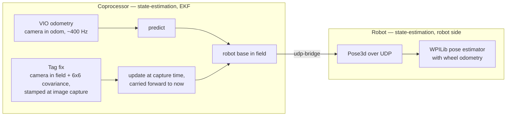

# Architecture

## Two programs, one wire

The software is split into two programs that share no process and no build system:

1. **The robot program** (Java, WPILib). It owns the motors, the swerve drive and the match
   logic, and runs a 20 ms loop on the robot controller (a roboRIO).
2. **A ROS 2 Jazzy graph** for the work that does not fit in that loop: camera processing, pose
   estimation and whole-body inverse kinematics. It ran on a NUC mini-PC coprocessor, and the
   later workspace runs the localization half on a SystemCore controller.

The two meet only on the wire: [`udp-bridge`](../udp-bridge/) carries everything the robot program
acts on, and [`nt-bridge`](../nt-bridge/) mirrors state to dashboards and tools.

## Two layers of pose estimation, one level deeper

This is the part most often misread. The coprocessor's EKF does **not** use wheel odometry; the
robot program fuses the wheels in a second, separate estimator (see the vision diagram in the
[root README](../README.md)). This diagram follows a pose through both layers.

- **Frames.** "odom" is the camera's own VIO map, which drifts and can jump. "field" is the
  competition field, and "base" is the robot body. Both inputs describe the camera, so both are
  moved to the robot base through the fixed camera mount. The filter's state is the base's pose
  in the field.
- **Timestamps.** A tag fix is stamped at image capture, so it is older than the filter's state
  when it arrives. The EKF applies it at the time the image was taken and carries the correction
  forward to the present. The robot side dates each received pose to its capture time before it
  fuses it.
- **Covariance.** The localizer's covariance travels with each fix, and the update weights the fix
  by it; it never accepts or rejects a fix by threshold. The EKF's own covariance does **not**
  cross the wire: the robot-side estimator uses fixed standard deviations, and resets to the
  coprocessor's pose instead when the two disagree by a large margin (at boot, or after a jump of
  the camera's map).
- **Why two layers.** Because the wheel-based estimate is kept aligned with the coprocessor's
  pose, a camera dropout hands over to a pose that is already correct.

## The wire

The UDP bridge uses two unicast sessions, one per direction, each on its own port. Every datagram
carries a topic name and a type hash, so a receiver drops what it does not expect instead of
misreading it. The same wire carries the whole-body controller's joint references to the robot
and the measured joints back. A reserved `__sync` topic measures the offset between the two
machines' clocks.

## Simulation

The robot program runs unchanged in WPILib simulation, because every mechanism reaches its motor
through the `MotorIO` interface ([`sim-io-layer`](../sim-io-layer/)): a TalonFX implementation on
the robot, a kinematic model in simulation. The UDP bridge also works over loopback, so the ROS 2
graph can drive the simulated robot program on one machine for end-to-end tests.

## Tuning bench

[`llm-tuning-agent`](../llm-tuning-agent/) is a separate rig: one arm joint on a roboRIO, wired to
a bench computer running a ROS 2 tuning node. A coding agent follows a written procedure and sends
one JSON directive at a time. The node enforces the gain bounds and the abort guards, whatever it
is sent. Gains reach the robot side through the NT4 bridge.

## Development network

I also built the network the robots are developed on. An Orange Pi 5 Plus is the gateway: it
provides DHCP, DNS and time, a firewall, NAT with a transparent proxy for internet access, and
LAN-only web consoles for device status, the proxy and practice matches. An access point carries
separate, isolated robot networks, built the way a competition field isolates them, plus a shared
development network that can reach every robot's controller and coprocessor.
