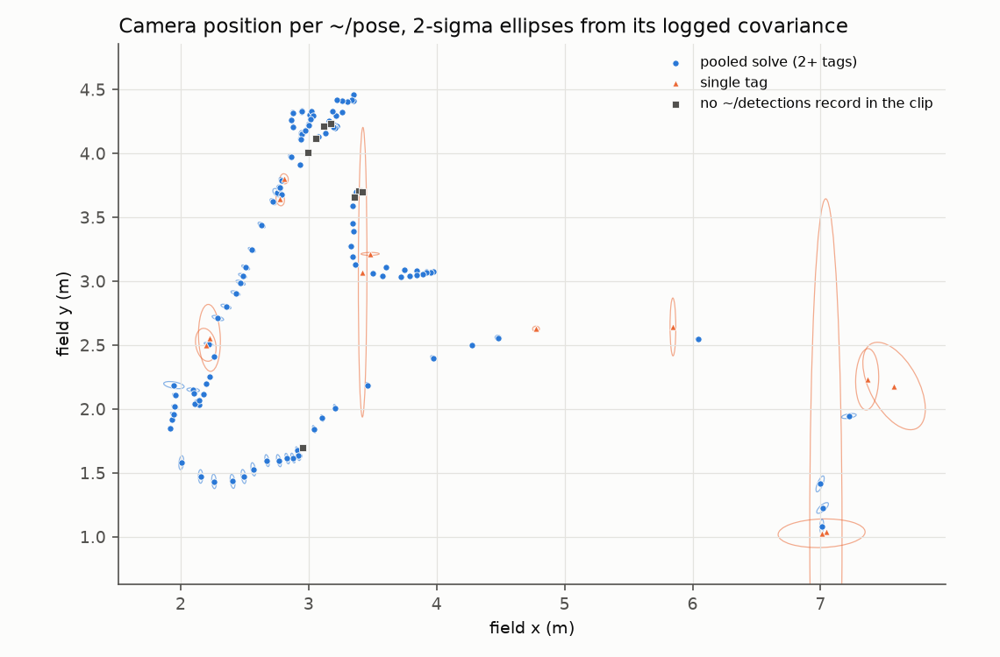
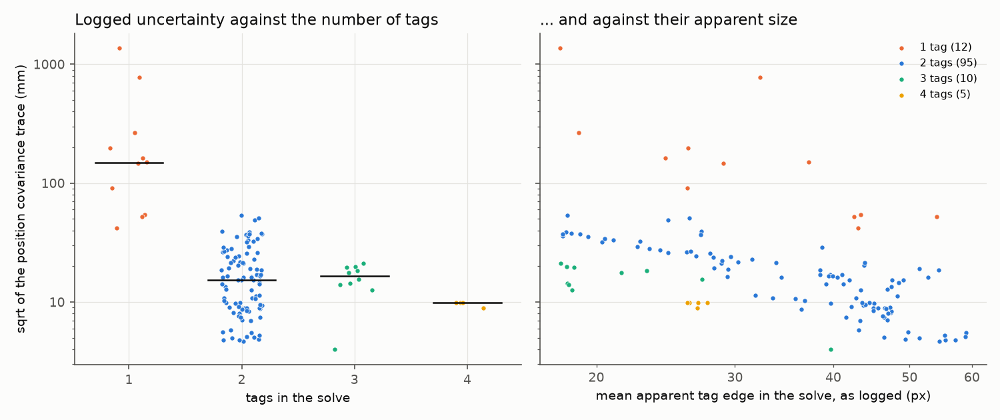

# perception-sqpnp: AprilTag field localizer with a pooled multi-tag SQPnP solve

[](https://replay-viewer-e62.pages.dev/?ds=remote-file&ds.url=https%3A%2F%2Fpub-0f92a4b175d3420290d73d6c2242fb57.r2.dev%2Fmatch%2Fmatch-20s.mcap&layoutUrl=https%3A%2F%2Fpub-0f92a4b175d3420290d73d6c2242fb57.r2.dev%2Fmatch%2Ffoxglove-layout.json) **[▶ Open in viewer](https://replay-viewer-e62.pages.dev/?ds=remote-file&ds.url=https%3A%2F%2Fpub-0f92a4b175d3420290d73d6c2242fb57.r2.dev%2Fmatch%2Fmatch-20s.mcap&layoutUrl=https%3A%2F%2Fpub-0f92a4b175d3420290d73d6c2242fb57.r2.dev%2Fmatch%2Ffoxglove-layout.json)**

Shown in motion on my project site: https://mai961.github.io/#vision

## What it does

It turns a camera image into the camera's pose on the field, plus a 6x6 covariance that states how
far that pose can be trusted. AprilTags are printed squares at known places on a competition field.
The node detects them, solves the camera pose from their corners, and publishes a
`geometry_msgs/PoseWithCovarianceStamped`. The node never opens a camera; it reads an image topic.
On the robot that topic came from the Odin camera's own driver, and `usb_camera_publisher.py`
provides the same topic from any USB webcam.

## Why it exists

The field EKF downstream (`state-estimation`) weights each tag fix by its covariance instead of
accepting or rejecting it with thresholds, so the localizer has to report a covariance that it
actually computed. Solving all visible tags as one target, instead of trusting the nearest tag,
also removes most of the two-way pose ambiguity that a single flat tag has.

## How it works

Each frame, the detected tags pass acceptance gates (decode quality, an allow-list, distance from
the image edge, range). All the tags that pass are solved as one target: one camera pose that
explains every visible corner, refined with per-corner weighting so that small, distant tags count
for less. The covariance is computed from that fit rather than assigned from a table. A frame with a
single tag is handled with an explicit term for the ambiguity of one flat square. When the geometry
does not constrain the pose, the node withholds it for that frame instead of publishing a pose with
an invented covariance. `usb_camera_publisher.py` is the input path for an ordinary webcam: it
forwards the camera's own MJPG frames as `sensor_msgs/CompressedImage`, unmodified and stamped at
capture.

## Interfaces

| Direction | Name | Type |
|---|---|---|
| in | `image_topic` (default `/odin1/image/compressed`) | `sensor_msgs/CompressedImage`, or `sensor_msgs/Image` |
| in | field layout | WPILib `AprilTagFieldLayout` JSON |
| in | camera calibration | intrinsics and distortion written by the camera driver |
| out | `~/pose` | `geometry_msgs/PoseWithCovarianceStamped`: camera in field, row-major 6x6 over `[x y z rx ry rz]` |
| out | `~/tag_poses` | `geometry_msgs/PoseArray`: each tag solved alone, used to check the field layout |
| out | `~/detections` | `std_msgs/String` (JSON): every detection, including rejected ones and why |

## How it was run

The node ran as a C++ ROS 2 Jazzy node next to the official Odin camera driver, first on the robot's
NUC coprocessor and later in the workspace for the SystemCore controller. Its `~/pose` fed the field
EKF. On the bench it ran from a USB webcam through the publisher script.

## Replay

This module shares the one match recording with `state-estimation`:
[`state-estimation/replay/match-20s.mcap`](../state-estimation/replay/), 20 s of a match cut from
the recorded bag `20260905-134217`, 66.8 s to 86.8 s after the bag's start, the same 20 s as the
match clip on the project site. Its topic table, and what was blurred, derived or copied to the
window start, are in the [`state-estimation` README](../state-estimation/#replay). For this module
it holds the localizer's outputs: `~/pose` (130 messages), `~/tag_poses`, `~/detections` (183 JSON
records, one per processed frame), the 18 per-frame `/viz/det/*` topics, and the debug image with
the camera scene blurred. The camera's raw frames are not in it.

To open it, run `ros2 bag play state-estimation/replay`, or open the `.mcap` file directly in
Foxglove Studio. Open it in the browser:
https://replay-viewer-e62.pages.dev/?ds=remote-file&ds.url=https%3A%2F%2Fpub-0f92a4b175d3420290d73d6c2242fb57.r2.dev%2Fmatch%2Fmatch-20s.mcap&layoutUrl=https%3A%2F%2Fpub-0f92a4b175d3420290d73d6c2242fb57.r2.dev%2Fmatch%2Ffoxglove-layout.json
(Lichtblick, an open-source build of Foxglove Studio, loads the clip and its layout from the
project's file mirror; no sign-in). The layout puts the localizer's debug image above a top-down
view of each fix with its covariance ellipse and each tag solved alone, next to a 3D view of the
field.

What to look for: in 110 of the 183 processed frames two to four tags are accepted and solved as one
target, and 12 frames are solved from a single tag. The single-tag fixes carry a much wider
covariance than the pooled ones (the ellipses in the figures below). No frame is withheld in this
window.

Read it without ROS (`pip install mcap-ros2-support`), from the repository root:

```python
import math
from mcap_ros2.reader import read_ros2_messages

BAG = "state-estimation/replay/match-20s.mcap"
for m in read_ros2_messages(BAG, topics=["/odin_apriltag_localizer/pose"]):
    p, cov = m.ros_msg.pose.pose.position, m.ros_msg.pose.covariance
    print(f"{m.log_time_ns / 1e9:.2f}  x={p.x:.3f} y={p.y:.3f} z={p.z:.3f} m"
          f"  sigma_x={1000 * math.sqrt(cov[0]):.1f} mm")
```

### Analysis

`replay/analyze_localizer.py` reads what the node logged and nothing else: the `~/detections`
records, `~/pose` with its covariance, and `/viz/det/chosen_reproj_err_px`, from the shared match
recording by default. It does not re-solve any frame; the reprojection error is the node's own, as
logged. From the repository root:

```sh
pip install -r requirements.txt     # numpy, matplotlib, mcap-ros2-support
python perception-sqpnp/replay/analyze_localizer.py     # --log <clip>, --out <dir>, --help
```

Output (0.8 s):

```
clip: match-20s.mcap   frames processed (~/detections): 183
  pooled (2+ tags solved as one): 110 (60.1 %)   2 tags: 95, 3 tags: 10, 4 tags: 5
  single tag:                      12 ( 6.6 %)
  withheld (tags accepted, no pose):   0 ( 0.0 %)
  no tag accepted:                 61 (33.3 %)
detections: 265, accepted 252, rejected 13 (edge 10, hamming 2, too_far 1)
~/pose: 130 messages; 122 match a solved frame's record, 8 have no ~/detections record in the clip
chosen tag reprojection error, as logged (/viz/det/chosen_reproj_err_px, 122 frames): median 0.035 px, 90 % under 0.100 px, max 0.294 px
sigma x from the logged covariance: median 7.5 mm over 130 poses
position sigma, sqrt of the covariance trace (x y z), by tags in the solve: 1 tag: median 149 mm (12); 2 tags: median 15 mm (95); 3 tags: median 17 mm (10); 4 tags: median 10 mm (5)
wrote perception-sqpnp/replay/replay_out/pose_xy.png and perception-sqpnp/replay/replay_out/cov_trace_vs_ntags.png
```

- A third of the frames have no tag accepted: the robot is turned away from every tag, or the tags
  it sees fail a gate (13 detections, mostly too close to the image edge).
- 8 published poses have no `~/detections` record in the clip: 5 records are missing from the
  recording (the solve's sequence numbers skip them), and 3 fall just after the window's end. The
  frame counts are over the 183 records; the sigma line is over all 130 poses.
- The node's uncertainty follows the geometry. A single-tag fix is about ten times less certain
  than a pooled one at the median. Among pooled fixes, the apparent size of the tags matters more
  than their number: the 3-tag frames in this window saw small, distant tags, and their median
  sigma is no better than the 2-tag frames' (right panel of the second figure).





Recordings © Zile Liao: they may be viewed and analysed, not redistributed. The scripts, layouts and
text are MIT-licensed with the rest of the repository.

## Status

**Status: recording + viewer + measured numbers.** The localizer's source is not in this
repository; `usb_camera_publisher.py` is the one excerpt kept, the webcam input path. The numbers
above are read from the recording by `replay/analyze_localizer.py`.

Replay data: `state-estimation/replay/match-20s.mcap`, shared with `state-estimation` (cut from a
recorded match; not the full bag).

Latency and accuracy against ground truth: not measured.

## Credits

The package started from Zimeng Chai's (GitHub `KeseterG`) port of `rambler_apriltag_localizer`.
The pooled multi-tag SQPnP solve, its weighted refine and the covariance were developed in this
fork, and the parameter set was extended. On the package path, 20 of 21 commits are by Zile Liao
and the other one is an AI-assistant commit; all 7 commits on the pooled solve are his
(`git log --no-merges --format=%an -- src/talos_apriltag_localizer` in the source repository).
