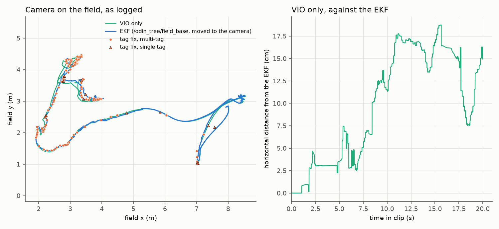
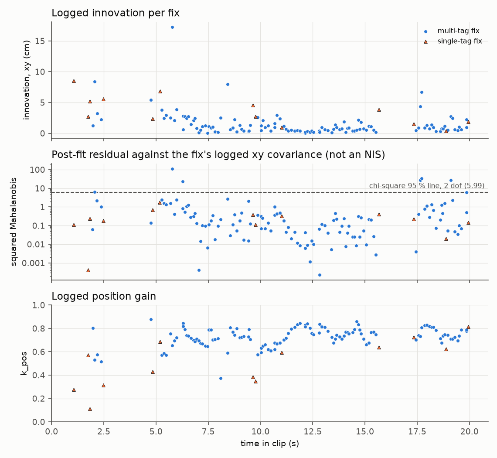

# state-estimation: field-pose EKF fusing VIO odometry with AprilTag fixes

[](https://replay-viewer-e62.pages.dev/?ds=remote-file&ds.url=https%3A%2F%2Fpub-0f92a4b175d3420290d73d6c2242fb57.r2.dev%2Fmatch%2Fmatch-20s.mcap&layoutUrl=https%3A%2F%2Fpub-0f92a4b175d3420290d73d6c2242fb57.r2.dev%2Fmatch%2Ffoxglove-layout.json) **[▶ Open in viewer](https://replay-viewer-e62.pages.dev/?ds=remote-file&ds.url=https%3A%2F%2Fpub-0f92a4b175d3420290d73d6c2242fb57.r2.dev%2Fmatch%2Fmatch-20s.mcap&layoutUrl=https%3A%2F%2Fpub-0f92a4b175d3420290d73d6c2242fb57.r2.dev%2Fmatch%2Ffoxglove-layout.json)**

Shown in motion on my project site: https://mai961.github.io/#vision

## What it does

It estimates where the robot is on the field, in two layers:

1. **On the ROS 2 side**: an extended Kalman filter (EKF) estimates the robot base's pose in the
   field frame. It predicts from the camera's visual-inertial odometry (VIO) and corrects with
   poses from the AprilTag localizer (`perception-sqpnp`). Each correction is weighted by the
   covariance the localizer computed for it. The result goes to the robot program over the UDP
   bridge.
2. **On the robot**: WPILib's `SwerveDrivePoseEstimator3d` fuses wheel odometry with that pose.

The EKF never sees wheel odometry. Wheel odometry enters only in the second layer.

## Why it exists

The node it replaced froze a field correction at the first good tag sighting. It then judged
every later sighting through hand-tuned gates (innovation size, robot speed, ambiguity), because
the tag solve did not say how good a pose was. Once the localizer published a measured covariance,
the gates could go. In the words of the source: "a measurement's weight is its covariance, and
the arithmetic of a Kalman update does what the gates were approximating."

The filter was written in Python first. It was ported to C++ to cut CPU load: the source records
the Python node at "0.47 of a core" at the camera driver's 400 Hz odometry rate, on the same CPU
as the robot program.

## How it works

The EKF runs over the robot's field pose. It predicts from every VIO sample, about 400 times a
second, and corrects with each tag fix, weighted by the covariance that came with the fix; no fix
is accepted or rejected by a threshold. A tag fix describes the moment its image was taken, which
is already in the past when it arrives, so the correction is applied at capture time and carried
forward to the present. The fused pose goes over the UDP bridge to the robot program, where
WPILib's pose estimator fuses it with wheel odometry, so that a camera dropout hands over to a
pose that is already right.

## Interfaces

| Direction | Topic | Type |
|---|---|---|
| in | `/odin1/odometry_highfreq` | `nav_msgs/Odometry`: VIO odometry from the Odin camera driver |
| in | `<localizer>/pose` | `geometry_msgs/PoseWithCovarianceStamped` from `perception-sqpnp` |
| in | `<localizer>/detections` | `std_msgs/String` (JSON): tells whether the solve was multi-tag ("pooled") |
| out | `/odin_tree/field_base` | `geometry_msgs/PoseStamped`. This wire name is fixed, because the robot program subscribes to it |

## How it was run

The EKF ran as a ROS 2 node next to the camera driver and the localizer. It ran first on the NUC
coprocessor and later on a SystemCore test unit. The Python and C++ implementations declare the
same parameters and the same topics, so the launch file picks one with a single argument.
The robot-side fusion ran in the robot program.

## Replay

`replay/match-20s.mcap` holds 20 s of a match, the same 20 s as the match clip on the project site.
It is the one match recording in this repository: it carries the localizer's outputs as well as the
EKF's inputs and outputs, and `perception-sqpnp` reads the same file. It was cut from the recorded
bag `20260905-134217`, 66.8 s to 86.8 s after the bag's start, and renamed, with the scene topics
the 3D views draw and the localizer's blurred debug image: 51 topics, 31,742 messages, 6.1 MB. The
camera's raw frames are not in it.

| Topic | Messages | Content |
|---|---|---|
| `/odin1/odometry_highfreq` | 7,995 | The EKF's predict input: VIO odometry, 400 Hz |
| `/odin_apriltag_localizer/pose` | 130 | The EKF's update input, `~/pose` of `perception-sqpnp`: camera in field, with its 6x6 covariance |
| `/odin_tree/field_base` | 7,996 | The EKF's output: the robot base's field pose, 400 Hz |
| `/viz/fix/*` (13 topics) | 130 each | The EKF's values per fix: innovation (xy, z, yaw), position gain `k_pos`, sigma, number of tags, whether it was applied and whether it corrected the heading; `/viz/fix/status` is a text summary |
| `/field_localizer/fix_event` | 130 | One JSON record per fix: status, number of tags, innovation, gain, sigma, and the state and measured positions |
| `/field_localizer/correction_delta` | 130 | The same innovation as a vector: x = xy distance (m), y = yaw (deg), z = height (m) |
| `/odin_apriltag_localizer/detections` | 183 | The localizer's `~/detections` (JSON): every detection in each processed frame, including rejected ones and why, and the solve's summary |
| `/odin_apriltag_localizer/tag_pose` | 130 | The same pose and stamp as `~/pose`, as a plain `PoseStamped` |
| `/odin_apriltag_localizer/tag_poses` | 130 | `~/tag_poses`: each tag solved alone |
| `/viz/det/*` (18 topics) | 122 to 183 each | The localizer's numbers per processed frame: tags found, accepted and rejected (by reason), detect and solve time, and the chosen tag's range, ambiguity, edge margin and reprojection error |
| `/odin_apriltag_localizer/debug_image/compressed` | 63 | The localizer's debug view (593x480), accepted tags outlined in green. The camera scene is blurred (Gaussian, sigma 3 px) so that no number on the arena banners and no face in the stands can be read; the tags and the green overlay stay sharp |
| `/odin_apriltag_localizer/camera_info` | 63 | Sent with each debug frame |
| `/tf`, `/tf_static` | 831, 1 | `field` to `odom` and to the measured camera; the arm's measured and reference links; `base` to the camera |
| `/viz/field` | 11 | The field for the 3D views (`foxglove_msgs/SceneUpdate`): outline, centerline, and the 32 tags as labelled cubes |
| `/viz/tag_seen` | 128 | The current fix as a sphere with a line to the robot, shown for 0.4 s |
| `/viz/robot_field` | 300 | The chassis outline, the planned chassis and a ghost arm, in the field frame |
| `/viz/odin_camera` | 130 | The camera pose of each fix (`foxglove_msgs/PoseInFrame`) |
| `/viz/field_base_path` | 381 | The robot's field-pose path as the robot recorded it (`nav_msgs/Path`; cumulative, so it starts before the window) |
| `/viz/field_base_pose` | 7,996 | The robot's field pose for the 3D views, 400 Hz |
| `/viz/fix_points` | 130 | Derived for display from the tag fixes: one point per fix; not recorded by the robot |
| `/viz/path_so_far` | 199 | Derived for display from `/odin_tree/field_base`: the path since the window start, every 0.1 s; not recorded by the robot |

`/tf_static` was published once, when the recording started, and `/viz/field` every 2 s; the last
message of each before the window is copied to the window start, so the frame tree and the field are
there from the first moment. The two derived topics carry a `derived` note in their channel
metadata, and the debug image is blurred, as its row says. All other messages are byte-for-byte as
recorded. The bag does not record which of the two implementations (see How it was run) produced
it.

To open it, run `ros2 bag play state-estimation/replay` (ROS 2 Jazzy reads MCAP out of the box;
older distributions need the `rosbag2_storage_mcap` plugin), or open the `.mcap` file directly in
Foxglove Studio. Open it in the browser:
https://replay-viewer-e62.pages.dev/?ds=remote-file&ds.url=https%3A%2F%2Fpub-0f92a4b175d3420290d73d6c2242fb57.r2.dev%2Fmatch%2Fmatch-20s.mcap&layoutUrl=https%3A%2F%2Fpub-0f92a4b175d3420290d73d6c2242fb57.r2.dev%2Fmatch%2Ffoxglove-layout.json
(Lichtblick, an open-source build of Foxglove Studio, loads the clip and
`replay/foxglove-layout.json` from the project's file mirror; no sign-in). Or open the local file in
Foxglove Studio and import `replay/foxglove-layout.json`. The video on the project site needs
nothing. The layout has two columns. On the left, the localizer's debug image sits above a top-down
fixes view: the field outline, the path so far (`/viz/path_so_far`), each fix as an orange point
that fades over 2 s (`/viz/fix_points`), the EKF's pose as a red arrow (`/odin_tree/field_base`),
the latest fix as axes with its covariance ellipse (`/odin_apriltag_localizer/pose`), and each tag
solved alone (`~/tag_poses`). On the right, a 3D view of the field (display frame `field`) shows the
tags as labelled cubes, the robot's pose, its chassis outline, and the current fix as a sphere with
a line to the robot.

What to look for: 130 tag fixes arrive in the 20 s, 117 of them multi-tag ("pooled"), while the
robot covers 26 m. Every fix is applied, the 117 pooled ones also correct the heading, and the
median position gain is 0.73. The innovation stays small: 1.0 cm median, 17 cm at most. Between
fixes, `/odin_tree/field_base` moves on at 400 Hz on the VIO odometry alone.

Read it without ROS (`pip install mcap-ros2-support`), from the repository root:

```python
from mcap_ros2.reader import read_ros2_messages

BAG = "state-estimation/replay/match-20s.mcap"
t0 = None
for m in read_ros2_messages(BAG, topics=["/viz/fix/innovation_xy_m"]):
    t0 = t0 or m.log_time_ns
    print(f"{(m.log_time_ns - t0) / 1e9:6.2f} s  innovation {100 * m.ros_msg.data:5.1f} cm")
```

### Analysis

`replay/analyze_field_ekf.py` reads only what the node read and wrote: the VIO odometry, the tag
fixes with their covariance, `/odin_tree/field_base`, the `field` to `odom` transform it published,
the camera mount on `/tf_static`, and its logged per-fix values on `/viz/fix/*` and
`/field_localizer/fix_event`. It runs no filter step. From the repository root:

```sh
pip install -r requirements.txt     # numpy, matplotlib, mcap-ros2-support
python state-estimation/replay/analyze_field_ekf.py     # --log <clip>, --out <dir>, --help
```

Output (2.0 s):

```
clip: match-20s.mcap   20.0 s
EKF output /odin_tree/field_base: 7996 poses, 400 Hz;  VIO /odin1/odometry_highfreq: 7995 samples, 400 Hz
distance covered by the EKF pose: 26.0 m
tag fixes /odin_apriltag_localizer/pose: 130;  logged per-fix values (/viz/fix/*): 130
updates in the clip: 130 (the node's update_count 459 to 588); applied 130; multi-tag 117, single-tag 13; heading corrected on 117
logged innovation: xy median 1.0 cm, max 17.2 cm; yaw median 0.07 deg, max 1.68 deg
logged position gain k_pos: median 0.73 (0.11 to 0.88); logged sigma_pos_m: median 3.0 cm
fix_event carries: applied, innovation_xy_m, innovation_yaw_deg, innovation_z_m, k_pos, measured_xyz_m, n_tags, reason, rotation_applied, seq, sigma_pos_m, sigma_yaw_deg, stamp, state_xyz_m, state_yaw_deg, status, update_count
innovation covariance: not logged, so no NIS; post-fit residual against the fix's logged covariance instead
post-fit residual (tag fix minus EKF at capture time, xy) over 130 fixes: median 0.3 cm, max 6.1 cm; squared Mahalanobis median 0.18, above the chi-square 95 % line (2 dof, 5.991): 7 of 130 (5.4 %)
  above the line: 7 of 7 multi-tag; tightest logged sigma 2 to 11 mm, residual 1.1 to 6.0 cm
VIO only (placed with the first field->odom transform, never corrected): 14.9 cm from the EKF at the end, max 18.7 cm
wrote state-estimation/replay/replay_out/trajectory.png and state-estimation/replay/replay_out/innovation.png
```

- The node had applied 458 fixes before the window starts (its `update_count`); in the window it
  applies all 130, 117 of them multi-tag.
- The log has the innovation of each fix but not its covariance, so a normalized innovation
  squared (NIS) cannot be formed from the log alone. The script uses a post-fit residual instead:
  each fix's camera position minus where the EKF puts the camera at that image's capture time,
  read from the `field` to `odom` transform the node published just after applying the fix and the
  VIO pose at the capture stamp. Its squared Mahalanobis distance uses the fix's own logged
  covariance. A post-fit residual has already been pulled toward the fix, so it reads low against
  that covariance; it shows that the published track and the fixes agree within the fixes' stated
  uncertainty, and it is not a filter-consistency test. The 7 fixes above the line are all
  multi-tag fixes whose covariance claims 2 to 11 mm in its tightest direction, against a residual
  of 1 to 6 cm.
- VIO alone, placed on the field once at the start of the window and never corrected, ends 15 cm
  from the EKF.





Recordings © Zile Liao: they may be viewed and analysed, not redistributed. The scripts, layouts and
text are MIT-licensed with the rest of the repository.

## Status

**Status: recording + viewer + measured numbers.** The filter's source is not in this repository.
The numbers above are read from the recording by `replay/analyze_field_ekf.py`.

Replay data: `replay/match-20s.mcap` (cut from a recorded match; not the full bag), shared with
`perception-sqpnp`.

Latency: not measured.

## Credits

The EKF was written by Zile Liao. The C++ port has 1 of 1 commits by Zile Liao
(`git log --no-merges --format=%an -- src/talos_field_localizer_cpp` in the SystemCore
workspace). The Python node has 37 of 38 commits by Zile Liao across its history
(`git log --follow --no-merges --format=%an -- src/talos_field_localizer/talos_field_localizer/field_localizer.py`
in the coprocessor workspace). The robot-side `OdinLocalizer.java` was written by Zile Liao, with
4 of 11 commits from teammates (`git log --follow --no-merges`).
