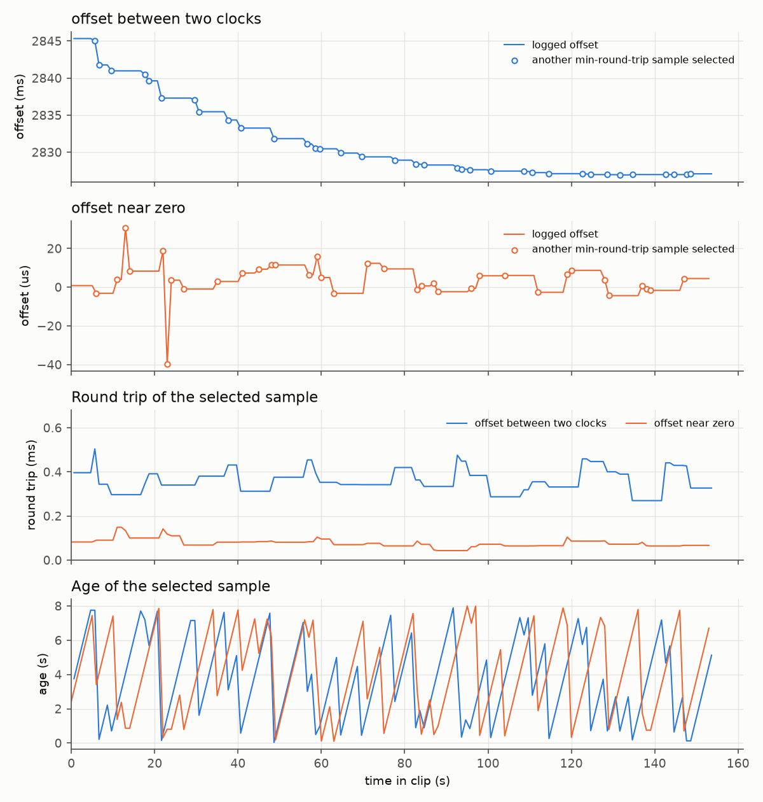

# udp-bridge: typed UDP pub/sub between a WPILib robot program and ROS 2

[](https://replay-viewer-e62.pages.dev/?ds=remote-file&ds.url=https%3A%2F%2Fpub-0f92a4b175d3420290d73d6c2242fb57.r2.dev%2Fudp-bridge%2Fclock-sync-154s.mcap&layoutUrl=https%3A%2F%2Fpub-0f92a4b175d3420290d73d6c2242fb57.r2.dev%2Fudp-bridge%2Ffoxglove-layout.json) **[▶ Open in viewer](https://replay-viewer-e62.pages.dev/?ds=remote-file&ds.url=https%3A%2F%2Fpub-0f92a4b175d3420290d73d6c2242fb57.r2.dev%2Fudp-bridge%2Fclock-sync-154s.mcap&layoutUrl=https%3A%2F%2Fpub-0f92a4b175d3420290d73d6c2242fb57.r2.dev%2Fudp-bridge%2Ffoxglove-layout.json)**

See the project site: https://mai961.github.io/

## What it does

It is a small publish/subscribe transport over plain UDP that connects the Java robot program
(WPILib, on the roboRIO) to the ROS 2 nodes on the coprocessor. Every datagram carries one message:
a topic name, a type tag and a binary payload. The transport is written once in C++. The robot
program uses it through JNI, packaged as a WPILib vendor library (vendordep). On the coprocessor,
a ROS 2 node forwards chosen ROS topics onto the wire and turns incoming datagrams back into ROS
messages. The same wire also measures the offset between the two machines' clocks.

## Why it exists

The design document in the source repository says this design "supersedes the v2 generic
ROS↔RIO bridge design (multicast, config-driven discovery, NT re-publish, latest-value cache) —
that was re-implementing LCM. This is a small, typed, topic-based UDP unicast pub/sub library that
replaces the legacy control transport. No cache, no discovery, no broker." Its stated goal was "a
lightweight typed pub/sub with minimal deps, implemented once in C++ with a JNI binding". It chose
binary structs over JSON because JSON "would need a parser lib (not 'minimal deps'), isn't a typed
enc/dec, and allocates per packet → GC pressure at 50 Hz" on the roboRIO.

## Why two bridges

This repository has two ROS bridges: this one, and [`nt-bridge`](../nt-bridge/) for
NetworkTables 4 (NT4), WPILib's own publish/subscribe system. The source documents divide the work
between them as follows:

- **UDP carries what the robot program acts on**: the fused field pose, the whole-body arm
  references and measurements, and operator commands. The SystemCore workspace README says it
  plainly: "The robot reads **UDP only**." The UDP bridge's package description calls it "the
  successor to talos_bridge's NT4 backend", using typed WPILib-struct datagrams.
- **NT4 is a mirror for people and tools.** The coprocessor runbook lists the NT4 bridge as
  "ROS → NT4 (`/Talos/Topics/...`) for the RIO/dashboard, and the Limelight botposes back in". The
  SystemCore config calls the NT copy of the pose "a debugging/logging convenience only", because
  "a RIO-side probe found zero NT readers of this key". Its parameter bridge also lets ROS
  parameters be edited from the robot side; the tuning bench uses that.

The sources do not compare the two bridges' latency, and neither does this README.

## How it works

```
 ROS 2 graph ──► ros_udp_bridge ── UDP :rio_port ──────► RIO subscriber session ──► robot code
 (coprocessor)        ▲                                     (Java, JNI socket)
                      └──────── UDP :coproc_port ◄──────── RIO publisher session ◄── robot code
                      clock ping "__sync" ──────────────► answered by the RIO's receive loop
```

1. `wire_format.hpp`: the frame layout (`[topicLen u8][topic][typeHash u32 LE][payload]`),
   `write_header`, and the FNV-1a type hash. A subscriber that registered one type drops a
   datagram tagged with another instead of misreading it. Two codecs are shown: `double[]` and
   `Pose3d`, which is 56 bytes laid out exactly like WPILib's `Pose3d` struct.
2. `udp_session.hpp`: `publish` encodes and sends. `receive_one` reads one datagram, routes the
   reserved `__sync` topic to `answer_clock_ping`, checks the topic and type, and calls the
   handler. Two-way traffic uses two sessions on two ports.
3. `clock_sync.hpp`: the NTP-style `clock_offset` and `round_trip` formulas. `estimate` trusts the
   sample with the smallest round trip out of the last 16, and `ping_once` is one cycle of the
   coprocessor's 2 Hz ping.
4. `RioReceiveLoop.java`: the same receive path on the roboRIO. The socket is C++ behind JNI, while
   decoding and the receive thread stay in Java. `answerClockPing` replies with WPILib's FPGA
   timestamp, so the offset is to the clock the robot program stamps with.
5. `ros_udp_bridge.cpp`: the ROS node. It finds each configured topic's type in the ROS graph, then
   forwards it. `PoseStamped` becomes `Pose3d`; `JointState` becomes a `double[]` in a fixed joint
   order, looked up by name. The reverse direction re-attaches the joint names.
6. `talos_udp_bridge.yaml`: the channel contract, with topics, ports and joint order.

## Interfaces

| Direction | Wire topic | Type | ROS side |
|---|---|---|---|
| coproc → RIO | `odin_tree/field_base` | `Pose3d` (56 B) | `/odin_tree/field_base` (`PoseStamped`), from `state-estimation` |
| coproc → RIO | `wholebody/references` | `double[]` `[q1, d, q3]` | `/wholebody/references` (`JointState`) |
| RIO → coproc | `wholebody/measured` | `double[]` `[q1, d, q3]` | `/wholebody/measured` (`JointState`) |
| both | `__sync` | `double[]` | clock estimate on `/talos_udp/clock` |

The Java API is `Session.publisher(destIp, port)` and `Session.subscriber(port, timeoutMs)`, then
`new Subscriber<>(session, topic, Codecs.POSE3D, pose -> ...)` or
`new Publisher<>(session, topic, Codecs.DOUBLE_ARRAY)`.

## How it was run

The C++ headers ran in the ROS 2 bridge node on the coprocessor. The JNI library and the Java
classes ran in the robot program, packaged as the `talos-udp` vendordep.
End-to-end tests ran the ROS side against the WPILib simulator over real UDP on one machine.

## Replay

`replay/clock-sync-154s.mcap` holds the bridge's clock estimate through a whole match: all 308
messages of `/talos_udp/clock` from the recorded bag `20260905-134217` (its full 154 s, and nothing
else from it), renamed, 18 KB. Each message is the `ClockSyncEstimate` of `clock_sync.hpp` as a
`Float64MultiArray`: `[offset_s, rtt_s, age_s, valid]`. The messages are byte-for-byte as recorded.

To open it, run `ros2 bag play udp-bridge/replay` (ROS 2 Jazzy reads MCAP out of the box; older
distributions need the `rosbag2_storage_mcap` plugin), or open the `.mcap` file directly in
Foxglove Studio and plot `/talos_udp/clock.data[0]` (offset), `.data[1]` (round trip) and
`.data[2]` (age).

Open it in the browser:
https://replay-viewer-e62.pages.dev/?ds=remote-file&ds.url=https%3A%2F%2Fpub-0f92a4b175d3420290d73d6c2242fb57.r2.dev%2Fudp-bridge%2Fclock-sync-154s.mcap&layoutUrl=https%3A%2F%2Fpub-0f92a4b175d3420290d73d6c2242fb57.r2.dev%2Fudp-bridge%2Ffoxglove-layout.json
(Lichtblick, an open-source build of Foxglove Studio, loads the clip and
`replay/foxglove-layout.json` from the project's file mirror; no sign-in). Or open the local file in
Foxglove Studio and import `replay/foxglove-layout.json`, which sets up the three plots above.

What to look for: two estimates are interleaved on the topic, each about once a second
(published at the config's 1 Hz; pings run at 2 Hz). In one, the offset is 2.8 s with a median
round trip of 0.34 ms; over the 154 s it drifts from 2.845 s to 2.827 s, so the two clocks ran at
slightly different rates. In the other, the offset stays within 40 µs of zero with a 0.07 ms round
trip, as between two endpoints that share one clock. The bag does not record which bridge session
published which. `age_s` climbs to about 8 s and drops back: `estimate` keeps the
smallest-round-trip sample of the last 16, and at the 2 Hz ping rate that sample can be up to 8 s
old.

Read it without ROS (`pip install mcap-ros2-support`), from the repository root:

```python
from mcap_ros2.reader import read_ros2_messages

BAG = "udp-bridge/replay/clock-sync-154s.mcap"
for m in read_ros2_messages(BAG, topics=["/talos_udp/clock"]):
    offset_s, rtt_s, age_s, valid = m.ros_msg.data
    print(f"{m.log_time_ns / 1e9:.3f}  offset {1e3 * offset_s:9.3f} ms"
          f"  rtt {1e6 * rtt_s:6.1f} us  age {age_s:4.2f} s  valid {valid:.0f}")
```

### Analysis

`replay/analyze_clock.py` reads the logged estimates on `/talos_udp/clock` and nothing else. It
splits the two interleaved series by the size of their offset and reports offset, round trip and
age for each; it recomputes nothing from pings. From the repository root:

```sh
pip install -r requirements.txt     # numpy, matplotlib, mcap-ros2-support
python udp-bridge/replay/analyze_clock.py     # --log <clip>, --out <dir>, --help
```

Output (0.6 s):

```
clip: clock-sync-154s.mcap   /talos_udp/clock: 308 messages over 154 s
offset between two clocks: 154 messages, one per 1.00 s, valid on 154
  offset 2.845 s at the start, 2.827 s at the end (drift -18.3 ms over 153 s)
  round trip median 0.34 ms (0.27 to 0.50 ms)
  age of the selected sample up to 7.9 s; selection changed 35 times
offset near zero: 154 messages, one per 1.00 s, valid on 154
  offset within 40 us of zero (from -39.7 to +30.7 us)
  round trip median 0.07 ms (0.04 to 0.15 ms)
  age of the selected sample up to 8.0 s; selection changed 35 times
wrote udp-bridge/replay/replay_out/clock_sync.png
```

The numbers quoted in "What to look for" above are these. A marked point in the figure is a message
whose offset and round trip differ from the one before, that is, where the estimate switched to
another sample; between switches the same sample is reported again and only its age grows.



Recordings © Zile Liao: they may be viewed and analysed, not redistributed. The scripts, layouts and
text keep the licenses stated below and in the repository's LICENSE.

## Status

**Status: recording + viewer + measured numbers.** The transport files are infrastructure
excerpts, simplified from the source; they will not compile or run on their own. The numbers above
are read from the recording by `replay/analyze_clock.py`.

Replay data: `replay/clock-sync-154s.mcap` (cut from a recorded match; the clock topic only, not the
full bag).

Latency and throughput: not measured.

## Credits

Written by Zile Liao: 9 of 9 commits on the transport library (`git log --no-merges --format=%an`
in the transport repository) and 8 of 8 on the ROS 2 package
(`git log --no-merges --format=%an -- src/talos_udp_bridge`). The ROS node reuses the
config-driven topic machinery of `talos_bridge` by Zimeng Chai (GitHub `KeseterG`; see
[`nt-bridge`](../nt-bridge/)), with the NT4 backend replaced by this transport.

The original ROS 2 package `talos_udp_bridge` is licensed BSD-3-Clause, and its excerpts here are
reproduced under that license.
